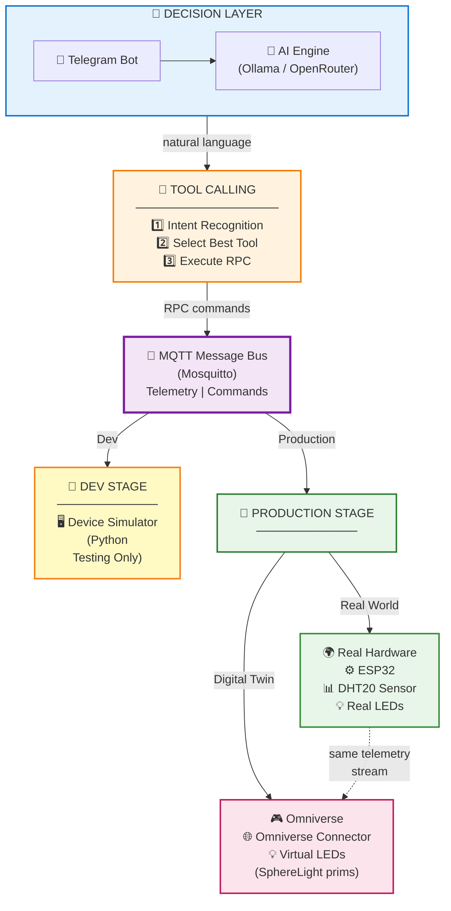
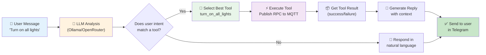

# AIoT Virtual Assistant: Voice-Controlled Smart Home Automation

**A next-generation AIoT system that bridges the gap between Natural Language Processing (NLP) and Physical Computing.**

This project implements a **Virtual Voice Assistant** capable of understanding human speech and controlling smart home devices via the **YOLO UNO ESP32-S3** (or YoLo:Bit) board. Unlike traditional IoT systems that rely on rigid app buttons, this assistant uses a "Brain" (High-Level AI) to interpret intent and a "Body" (Low-Level Firmware) to execute actions.

---

## Table of Contents

- [System Architecture](#system-architecture)
- [Project Structure](#project-structure)
- [Development Roadmap](#development-roadmap)
- [Hardware Setup](#hardware-setup)
- [Communication Protocol](#communication-protocol)
- [Tech Stack](#tech-stack)
- [Full End-to-End Guide: Two Paths](#full-end-to-end-guide-two-paths)
  - [Path A — With Real ESP32 Hardware](#path-a--with-real-esp32-hardware)
  - [Path B — Simulator Only (No Board)](#path-b--simulator-only-no-board)
- [HERA Bot Setup (LLM + Telegram)](#hera-bot-setup-llm--telegram)
- [NVIDIA Omniverse Digital Twin](#nvidia-omniverse-digital-twin)
- [TinyML Anomaly Detection Model](#tinyml-anomaly-detection-model)
- [Troubleshooting](#troubleshooting)

---

## System Architecture

The system is divided into **three layers**, communicating via **MQTT**.

### 1. High-Level Layer (The Brain) — `python/HERA/`
- **Role:** Perception & Decision Making
- **Platform:** Python on PC / Raspberry Pi
- **Core Functions:**
  - **LLM (Ollama + OpenRouter):** Supports local Ollama (qwen2.5:7b) and cloud OpenRouter for budget-friendly AI
  - **Tool Calling:** LLM intelligently selects from 6 available tools to control dual LED system
  - **MQTT Client:** Subscribes to telemetry, publishes RPC commands for device control

### 2. Low-Level Layer (The Body) — `src/` (PlatformIO firmware)
- **Role:** Execution & Sensing
- **Platform:** ESP32-S3 (Yolo UNO)
- **Core Functions:**
  - **Dual LED Control:** White indicator LED + RGB NeoPixel LED via MQTT RPC
  - **Sensing:** Reads DHT20 (temp/humidity) via I2C
  - **On-device ML:** TFLite Micro anomaly detection
  - **Connectivity:** WiFi + MQTT to CoreIOT / local broker

### 3. Digital Twin Layer — NVIDIA Omniverse
- **Role:** 3D Visualization
- **Platform:** Omniverse Kit (USD Composer / Presenter)
- **Core Functions:**
  - Subscribes to MQTT telemetry
  - Controls USD SphereLight prim (on/off, color) in real-time

---

## Project Structure

```
MP-AI-252/
├── src/                           # ESP32 firmware source (PlatformIO)
├── include/                       # Firmware headers
├── lib/                           # Firmware libraries (DHT20, ArduinoJson, etc.)
├── boards/                        # Custom board definitions (yolo_uno.json)
├── data/                          # Filesystem upload folder (LittleFS)
├── platformio.ini                 # PlatformIO build config
│
├── python/
│   ├── HERA/                      # AI-powered Telegram bot + simulator
│   │   ├── hera_bot.py            #    LLM bot (Ollama + OpenRouter dual provider)
│   │   ├── device_simulator.py    #    ESP32 MQTT simulator (no board needed)
│   │   ├── omniverse_connector.py #    Omniverse digital twin bridge
│   │   └── requirements.txt       #    Python dependencies
│   │
│   ├── CoreIOT Simulator/         # CoreIOT/ThingsBoard simulator scripts
│   ├── Telegram Bot/              # Standalone Telegram bot (no LLM)
│   ├── Tiny ML/                   # TinyML anomaly detection model training
│   │   ├── TFL_For_MCU.py         #    Train + export to TFLite + C header
│   │   ├── data_cleaner.py        #    Label anomalies in dataset
│   │   ├── data/                  #    Raw training CSV
│   │   └── trained models/        #    Exported .keras, .tflite, .h files
│   └── omniverse/
│       └── official.usd           # 3D scene file for Omniverse
│
├── web/                           # (Planned) React + Tailwind dashboard
├── tomtat.md                      # Vietnamese project planning document
└── README.md                      # This file
```

---

## Development Roadmap

| Phase | Period | Focus |
|-------|--------|-------|
| 1 | Feb 9 - Mar 22 (Midterm) | Raw data + device control (LED, DHT20, LCD) |
| 2 | Feb 9 - Mar 22 (Midterm) | Dashboard MVP |
| 3 | Mar 22 - May 17 (Final) | AI / NLP / Voice assistant |
| 4 | Mar 22 - May 17 (Final) | Polish, ML, Omniverse, final demo |

---

## Hardware Setup

| Component | Description |
|-----------|-------------|
| YOLO UNO (ESP32-S3) | Main MCU — WiFi, BLE, USB-C |
| DHT20 | Temperature & humidity sensor (I2C) |
| LED (built-in) | Indicator LED on GPIO |
| NeoPixel (WS2812) | RGB LED strip/pixel |
| LCD (I2C) | 16x2 character display |

> **No hardware?** Skip to [Path B — Simulator Only](#path-b--simulator-only-no-board).

---

## Communication Protocol

All components communicate via **MQTT** (Message Queuing Telemetry Transport):

```
ESP32 / Simulator  --publish-->  Mosquitto Broker  <--subscribe--  HERA Bot
                                       |                          Omniverse
                                       v
                             Topics:
                             - v1/devices/me/telemetry       (sensor data)
                             - v1/devices/me/rpc/request/+   (control commands)
                             - v1/devices/me/attributes      (state feedback)
```

**Telemetry payload (JSON):**
```json
{
  "temperature": 28.5,
  "humidity": 65.0,
  "inference_result": 0.12,
  "led_state": true,
  "neo_led_state": true
}
```

**RPC command payload (JSON):**
```json
{
  "method": "setValueLedBlinky",
  "params": true
}
```

---

## Tech Stack

| Layer | Technology |
|-------|-----------|
| Firmware | C++ / Arduino / PlatformIO / FreeRTOS |
| ML on device | TensorFlow Lite Micro |
| MQTT broker | Eclipse Mosquitto |
| LLM | Ollama (local, free) + OpenRouter (cloud, budget) |
| Telegram bot | python-telegram-bot + dual provider LLM with 6-tool system |
| Digital Twin | NVIDIA Omniverse (USD, pxr, UsdLux) |
| Dashboard (planned) | React + Tailwind CSS + Node/Express + Socket.IO |

---

# Full End-to-End Guide: Two Paths

Choose the path that matches your situation:

| Path | When to use |
|------|------------|
| **Path A** | You have the YOLO UNO ESP32-S3 board with sensors |
| **Path B** | No board — everything runs on your laptop using the simulator |

Both paths end at the same destination: **HERA bot controlling devices via Telegram, with an Omniverse 3D scene reacting in real-time.**

---

## Path A — With Real ESP32 Hardware

### A1. Install prerequisites

Install the following on your computer:

| Software | How to install |
|----------|---------------|
| VS Code | https://code.visualstudio.com |
| PlatformIO extension | VS Code Extensions → search "PlatformIO IDE" → Install |
| Python 3.10+ | https://www.python.org/downloads/ |
| Mosquitto | See step A2 below |
| Ollama | See step A5 below |
| Git | https://git-scm.com |

### A2. Install and start Mosquitto MQTT broker

**Windows:**
```bash
winget install EclipseFoundation.Mosquitto
```

**macOS:**
```bash
brew install mosquitto
```

**Ubuntu/Debian:**
```bash
sudo apt install mosquitto mosquitto-clients
```

**Start the broker:**

Windows (run as Administrator):
```bash
net start mosquitto
```

Or run manually (any OS):
```bash
mosquitto -v
```

Verify it's running — you should see:
```
mosquitto version X.X.X starting
Opening ipv4 listen socket on port 1883.
```

Keep this terminal open.

### A3. Flash the firmware to ESP32

1. Open this repo folder in VS Code (PlatformIO will auto-detect `platformio.ini`).

2. Connect the YOLO UNO board via USB-C.

3. Edit WiFi credentials in `include/global.h`:
   ```cpp
   const char* ssid = "YOUR_WIFI_SSID";
   const char* password = "YOUR_WIFI_PASSWORD";
   ```

4. Edit MQTT broker IP in `src/coreiot.cpp` to point to your laptop's local IP (the machine running Mosquitto):
   ```cpp
   const char* mqtt_server = "192.168.x.x";  // your laptop's IP on WiFi
   ```
   Find your IP: open a terminal and run `ipconfig` (Windows) or `ifconfig` (macOS/Linux).

5. Build and upload the firmware:
   ```bash
   platformio run --target upload
   ```

6. Open Serial Monitor to verify the board is publishing data:
   ```bash
   platformio device monitor --baud 115200
   ```
   You should see telemetry printing (temperature, humidity) every few seconds.

7. Verify MQTT messages are arriving — open a **new terminal**:
   ```bash
   mosquitto_sub -h localhost -t "v1/devices/me/telemetry" -v
   ```
   You should see JSON payloads arriving from the board.

### A4. Continue to HERA bot setup

Skip to [HERA Bot Setup](#hera-bot-setup-llm--telegram).

---

## Path B — Simulator Only (No Board)

Everything runs on your **laptop** — no ESP32 needed.

### B1. Install prerequisites

| Software | How to install |
|----------|---------------|
| Python 3.10+ | https://www.python.org/downloads/ |
| Mosquitto | See instructions below |
| Ollama | See step B4 below |

### B2. Install and start Mosquitto

Same as [step A2 above](#a2-install-and-start-mosquitto-mqtt-broker).

After installing, start the broker in a terminal:
```bash
mosquitto -v
```
Keep this terminal open.

### B3. Install Python dependencies

Open a **new terminal**:

```bash
cd python/HERA
pip install -r requirements.txt
```

This installs:
- `paho-mqtt` — MQTT client library
- `python-telegram-bot` — Telegram bot framework
- `ollama` — Ollama Python SDK

### B4. Install Ollama and pull the model

1. Download and install Ollama from https://ollama.com/download

2. Verify installation:
   ```bash
   ollama --version
   ```

3. Pull the LLM model (one-time download, ~4.7 GB):
   ```bash
   ollama pull qwen2.5:7b
   ```

   **Hardware requirements:**
   - GPU mode: ~6 GB VRAM (RTX 3060+ recommended)
   - CPU mode: 8 GB+ RAM (slower but works)

   **Alternative lighter models** (if low on VRAM):
   ```bash
   ollama pull qwen2.5:3b     # ~2 GB, less accurate
   ollama pull phi3:mini       # ~2.3 GB
   ```
   If you use a different model, update the `.env` file in `python/HERA/`.

4. Verify the model is ready:
   ```bash
   ollama list
   ```
   You should see `qwen2.5:7b` in the list.

### B5. Start the device simulator

Open a **new terminal** (keep Mosquitto running in the other one):

```bash
cd python/HERA
python device_simulator.py
```

You should see:
```
=======================================================
   ESP32 IoT Device Simulator
=======================================================
Broker : localhost:1883
Interval: every 5s

[Simulator] Connected to MQTT broker!
[Simulator] Subscribed to: v1/devices/me/rpc/request/+
[Simulator] Publishing telemetry every 5s...

[Simulator]  T=28.5°C  H=65.0%  Anomaly=0.15  LED=ON  NeoLED=ON
[Simulator]  T=28.3°C  H=65.8%  Anomaly=0.22  LED=ON  NeoLED=ON
```

The simulator:
- Publishes fake telemetry every 5 seconds (temperature and humidity drift randomly)
- Responds to RPC commands (LED on/off, NeoPixel on/off) — same protocol as the real board
- Mimics the TinyML anomaly score (>0.5 = anomaly when readings are out of 25-35°C / 60-80%)

**If you see `ConnectionRefusedError`:** Mosquitto is not running. Go back to B2.

Keep this terminal open.

### B6. Continue to HERA bot setup

Continue to the next section.

---

## HERA Bot Setup (LLM + Telegram)

HERA is an AI-powered Telegram bot that supports **dual LLM providers**: 
- **Ollama** (local, free): qwen2.5:7b model running on your machine
- **OpenRouter** (cloud, budget-friendly): Access to various models for ~$0.20/1M tokens

The bot uses **advanced tool calling** with 6 specialized tools to control a **dual LED system** (white indicator + RGB NeoPixel) via natural language in Telegram.

### HERA Architecture — Two Deployment Modes



**Chart Flow:**
1. **Decision Layer:** User message → AI Engine analyzes intent
2. **Tool Calling:** LLM recognizes what tool to use → Executes RPC command
3. **MQTT Bus:** Routes command to devices
4. **Dev/Production:** Simulator for testing OR Real hardware + Omniverse twin synced

### Step 1: Choose your LLM provider

**Option A - Ollama (Local, Free):**
```bash
# Install from https://ollama.com/download
ollama pull qwen2.5:7b
ollama list    # verify qwen2.5:7b appears
```

**Option B - OpenRouter (Cloud, Budget):**
1. Sign up at [openrouter.ai](https://openrouter.ai)
2. Get your API key from the keys section
3. Create `.env` file in `python/HERA/` folder:
```bash
OPENROUTER_API_KEY=sk-or-v1-your-api-key-here
OPENROUTER_MODEL=qwen/qwen-2.5-7b-instruct  # Budget-friendly option
```

### Step 2: Create a Telegram bot

1. Open Telegram on your phone or desktop
2. Search for **@BotFather** and open a chat with it
3. Send the command: `/newbot`
4. BotFather will ask for a **name** — type anything, e.g.: `HERA IoT Assistant`
5. BotFather will ask for a **username** — must end in "bot", e.g.: `hera_iot_252_bot`
6. BotFather will reply with your **bot token** — it looks like:
   ```
   1234567890:ABCdefGhIjKlMnOpQrStUvWxYz
   ```
7. **Copy this token** — you'll need it in the next step

### Step 3: Configure the environment

Create a `.env` file in the `python/HERA/` directory:

```bash
# Required for both providers
TELEGRAM_BOT_TOKEN=your_bot_token_from_botfather

# For Ollama (local)
OLLAMA_MODEL=qwen2.5:7b

# For OpenRouter (cloud) - only needed if using OpenRouter
OPENROUTER_API_KEY=sk-or-v1-your-api-key-here
OPENROUTER_MODEL=qwen/qwen-2.5-7b-instruct

# MQTT Configuration (optional, defaults shown)
MQTT_BROKER=localhost
MQTT_PORT=1883
```

**Quick setup with team's bot token:**
```bash
TELEGRAM_BOT_TOKEN=8452424681:AAEtG3OeO1KP48OwC_zG0b8QapaeX1htmzU
```

### Step 4: Start HERA and select provider

Open a **new terminal** (keep Mosquitto and simulator/board running):

```bash
cd python/HERA
python hera_bot.py
```

The bot will prompt you to select a provider:
```
🤖 HERA - LLM Provider Selection
═══════════════════════════════════════
Choose your LLM provider:
1. 🏠 Ollama (Local) - Free
2. ☁️  OpenRouter (Cloud) - Budget models (~$0.20/1M tokens)
3. ❓ Help me decide

Enter your choice (1-3): 1
```

After selection, you should see:
```
[HERA] Selected provider: ollama
[HERA] 🏠 LLM Provider: Ollama (Local)  
[HERA] 🤖 Model: qwen2.5:7b
[HERA] MQTT connected (localhost:1883)
[HERA] Starting Telegram bot...
[HERA] Send /start to your bot in Telegram!
```

### Tool Calling System & Intent Recognition

HERA uses **advanced LLM tool calling** to intelligently interpret natural language and execute actions.

#### How Tool Calling Works



#### Available Tools (6 Specialized Functions)

The LLM can intelligently select from these tools based on user intent:

| Tool Name | Triggered By | Action | Example |
|-----------|--------------|--------|---------|
| `turn_on_led` | "turn on white", "turn on indicator" | Control main LED | User: "Turn on the white light" |
| `turn_off_led` | "turn off white", "turn off indicator" | Control main LED | User: "Turn off indicator" |
| `turn_on_neo_led` | "turn on rgb", "color on", "glow" | Control RGB NeoPixel | User: "Turn on the colorful light" |
| `turn_off_neo_led` | "turn off rgb", "color off" | Control RGB NeoPixel | User: "Turn off the glow" |
| `turn_on_all_lights` | "turn on all", "light on", "lights on" | Both LEDs ON | User: "Turn on all lights" |
| `turn_off_all_lights` | "turn off all", "lights off", "turn off everything" | Both LEDs OFF | User: "Turn everything off" |

#### Example Conversation Flow

```
┌─────────────────────────────────────────────────────────────┐
│ USER: "Hey HERA, can you turn on the colorful light?"       │
└─────────────────────────────────────────────────────────────┘
                            ↓
┌─────────────────────────────────────────────────────────────┐
│ HERA BOT (Internal Processing):                              │
│ 1. Receive: "turn on the colorful light"                    │
│ 2. Send to LLM: Extract intent + available tools            │
│ 3. LLM Analysis: "colorful" → matches neo LED               │
│ 4. LLM Decision: Select tool "turn_on_neo_led"              │
└─────────────────────────────────────────────────────────────┘
                            ↓
┌─────────────────────────────────────────────────────────────┐
│ MQTT COMMAND (via MQTT Broker):                             │
│ Topic: v1/devices/me/rpc/request/led_control                │
│ Payload: {"method":"turn_on_neo_led", "params":{...}}       │
└─────────────────────────────────────────────────────────────┘
                            ↓
┌─────────────────────────────────────────────────────────────┐
│ DEVICE (Simulator / ESP32):                                  │
│ 1. Receive RPC command                                      │
│ 2. Turn on NeoPixel RGB LED                                 │
│ 3. Publish telemetry: {"neo_led_state": true}               │
└─────────────────────────────────────────────────────────────┘
                            ↓
┌─────────────────────────────────────────────────────────────┐
│ OMNIVERSE (Digital Twin):                                    │
│ 1. Receive telemetry via MQTT                               │
│ 2. Detect neo_led_state change                              │
│ 3. Update SphereLight2 prim → glow                           │
└─────────────────────────────────────────────────────────────┘
                            ↓
┌─────────────────────────────────────────────────────────────┐
│ HERA TELEGRAM REPLY:                                         │
│ "🎉 RGB light is now ON! Have fun with the colors!"         │
└─────────────────────────────────────────────────────────────┘
```

### Step 5: Test in Telegram

Open Telegram and find your bot (search for the username you chose). HERA now supports **6 specialized tools** for controlling a **dual LED system**:

| You type | HERA's tools & actions |
|----------|----------------------|
| `/start` | Greets you with instructions |
| "What's the temperature?" | `get_sensor_status` → displays temp/humidity/anomaly data |
| "Turn on the white LED" | `turn_on_led` → controls white indicator LED only |
| "Turn on the colorful LED" | `turn_on_neo_led` → controls RGB NeoPixel only |
| "Turn on all lights" | `turn_on_all_lights` → controls both LEDs simultaneously |
| "Turn off the white LED" | `turn_off_led` → turns off indicator LED |
| "Turn off the colorful LED" | `turn_off_neo_led` → turns off NeoPixel |
| "Turn off all lights" | `turn_off_all_lights` → turns off both LEDs |
| "Is everything normal?" | `get_sensor_status` + AI analysis of anomaly scores |
| `/status` | Raw sensor data (no LLM, instant response) |
| `/reset` | Clears conversation history |

**Dual LED System:**
- **White Indicator LED:** Basic on/off control for status indication
- **RGB NeoPixel LED:** Programmable color LED for visual feedback

**How it works internally:**

```
You: "Turn on all lights"
    ↓
hera_bot.py receives message  
    ↓
LLM analyzes intent → selects turn_on_all_lights tool
    ↓
Tool executes: publishes 2 MQTT RPC commands
    ↓
Simulator/ESP32 receives RPCs → toggles both LEDs
    ↓
LLM receives tool result → generates natural reply
    ↓  
You receive: "Both lights have been turned on."
```

---

## NVIDIA Omniverse Digital Twin

This section guides you through connecting the MQTT data stream to a **3D scene in NVIDIA Omniverse**, creating a real-time digital twin where lights toggle visually when you send commands via the HERA Telegram bot.

### Prerequisites

- **NVIDIA GPU**: RTX 2070 or higher recommended (RTX 3060+ ideal)
- **NVIDIA Omniverse Launcher**: Download from https://www.nvidia.com/en-us/omniverse/
- Mosquitto + simulator (or real board) already running

### OV-Step 1: Install NVIDIA Omniverse Launcher

1. Go to https://www.nvidia.com/en-us/omniverse/
2. Click **Download** and create an NVIDIA account if needed
3. Install the Launcher application
4. Sign in

### OV-Step 2: Install an Omniverse app

1. Open **Omniverse Launcher**
2. Go to the **Exchange** tab
3. Search for **USD Composer** (or **Create** — any Kit-based app works)
4. Click **Install** and wait for download
5. Once installed, click **Launch**

### OV-Step 3: Open the 3D scene

1. In the Omniverse app, go to **File -> Open**
2. Navigate to this repo's folder and open:
   ```
   python/omniverse/official.usd
   ```
3. The 3D smarthome scene will load in the viewport

### OV-Step 4: Understand the Stage panel and prim paths

Every object in Omniverse is a **"prim"** (primitive) with a unique path (like a file path on disk).

1. Open the **Stage** panel: click **Window -> Stage** in the top menu
2. You'll see a tree of all objects in the scene, e.g.:
   ```
   /Chinese_interior_scene
       /Lamp_Ceiling_114_44_001
       /Lamp_Ceiling_114_44_002
       /Table_001
       ...
   ```
3. Click on any prim in the Stage panel (or in the viewport)
4. Look at the **Property** panel on the right side — you'll see the **Prim Path** field showing the path like `/Chinese_interior_scene/Lamp_Ceiling_114_44_001`
5. Expand prims by clicking the triangle ▸ next to their names to see children

**Important:** The lamp meshes in the scene are *geometry only* — they look like lamps but don't actually emit light in the rendering engine. To have a controllable light, you need to create a USD **SphereLight** prim.

### OV-Step 5: Create a SphereLight prim

This is the light that will be controlled by MQTT:

1. Navigate in the viewport to find a good spot for a light (near a ceiling lamp looks best)
2. In the **top menu bar**, click: **Create -> Light -> Sphere Light**
3. A new `SphereLight` prim will appear in the Stage panel (usually at `/SphereLight`)
4. With the SphereLight selected, look at the **Property** panel on the right:
   - **Intensity**: type `30000` and press Enter — the light should turn on brightly in the scene
   - **Color**: click the color swatch to change the light color
   - **Radius**: adjust if you want a bigger/smaller light source

5. **Test it manually:**
   - Set Intensity to `30000` → light turns on (bright)
   - Set Intensity to `0` → light turns off (dark)
   - This confirms the prim path and intensity values work

6. **Note the Prim Path** — click the SphereLight in the Stage panel and check the Property panel. It should say something like `/SphereLight`. You'll need this exact path in the next step.

### OV-Step 6: Install paho-mqtt in Omniverse's Python

Omniverse has its **own built-in Python** interpreter (separate from your system Python). You need to install the MQTT library into it:

1. In Omniverse, go to **Developer -> Script Editor**
   - If you don't see "Developer" in the menu bar: go to **Window -> Extensions**, search for "Script Editor", and enable it
2. In the Script Editor window (bottom half is the code area, top half is the console), type this **one-liner** in the code area:

   ```python
   import omni.kit.pipapi; omni.kit.pipapi.install("paho-mqtt")
   ```

3. Click the **Run (Ctrl+Enter)** button at the bottom-left of the Script Editor
4. Wait for the console output to show success (may take 30 seconds)
5. You only need to do this **once** per Omniverse installation

### OV-Step 7: Configure and paste the connector script

1. Open the file `python/HERA/omniverse_connector.py` on your computer in any text editor (VS Code, Notepad, etc.)

2. Check these lines near the top and make sure they match your setup:

   ```python
   MQTT_BROKER    = "localhost"     # your MQTT broker address
   MQTT_PORT      = 1883           # default Mosquitto port
   LED_LIGHT_PATH = "/SphereLight" # must match YOUR prim path from Step 5
   ```

   If your SphereLight has a different path (e.g., `/World/SphereLight`), update `LED_LIGHT_PATH` accordingly.

3. Select **ALL** the content of `omniverse_connector.py`:
   - Press **Ctrl+A** to select all
   - Press **Ctrl+C** to copy

4. Go back to the Omniverse **Script Editor** (Developer -> Script Editor)

5. **Clear** any previous code in the code area (select all and delete)

6. **Paste** the connector script (**Ctrl+V**)

7. Click **Run (Ctrl+Enter)**

You should see in the Script Editor console:

```
=============================================
  Digital Twin — LED Demo
=============================================
  Light prim : /SphereLight
  Broker     : localhost:1883

[OV] Connected to MQTT broker
[OV] Listening... Start device_simulator.py to see it work!
[OV] Or use HERA bot: 'turn on the LED'
```

### OV-Step 8: Test the full system

At this point you should have **4 things running simultaneously**:

| # | Where | What | Command / Action |
|---|-------|------|-----------------|
| 1 | Terminal 1 | Mosquitto broker | `mosquitto -v` |
| 2 | Terminal 2 | Device simulator (Path B) or real ESP32 (Path A) | `cd python/HERA && python device_simulator.py` |
| 3 | Terminal 3 | HERA Telegram bot | `cd python/HERA && python hera_bot.py` |
| 4 | Omniverse | Connector script running in Script Editor | Paste + Run (Ctrl+Enter) |

**Now test the full chain:**

1. Open **Telegram** on your phone or desktop
2. Find your HERA bot and type: **"turn on the LED"**
3. Watch the **Omniverse viewport** — the SphereLight should turn **bright yellow**
4. In Telegram, type: **"turn off the LED"**
5. Watch Omniverse — the SphereLight goes **dark** (intensity drops to 0)

**What happens behind the scenes:**

```
Step 1: You type "turn on the LED" in Telegram
Step 2: hera_bot.py → LLM (Ollama/OpenRouter) decides to call turn_on_led tool
Step 3: Tool publishes MQTT RPC: {"method":"setValueLedBlinky","params":true}
Step 4: Mosquitto broker routes the message
Step 5: device_simulator.py receives RPC → sets LED=ON → publishes telemetry with led_state=true
Step 6: Mosquitto broker routes telemetry
Step 7: omniverse_connector.py receives telemetry → sees led_state=true
Step 8: Connector sets SphereLight intensity to 30000 and color to warm yellow
Step 9: Omniverse renders the light change in real-time
Step 10: LLM generates reply → you see "Done! The LED is now on." in Telegram
```

### Omniverse troubleshooting

| Problem | Solution |
|---------|----------|
| "paho-mqtt not found" error in Script Editor | Run `import omni.kit.pipapi; omni.kit.pipapi.install("paho-mqtt")` first |
| "[OV] Prim not found: /SphereLight" | Your SphereLight has a different path — check Stage panel -> click prim -> Property panel -> Prim Path |
| Light doesn't visually change | Make sure you're using **RTX Real-Time** or **RTX Interactive** render mode (not "Storm") |
| Script Editor not visible | It's under the **Developer** menu (not Window) |
| "CalledProcessError" on pip | Normal for old auto-install — use `omni.kit.pipapi.install()` instead |
| Console shows `[OV] LED -> ON` but no visual change | Check if your SphereLight intensity values work manually first (set 30000 in Property panel) |
| Omniverse crashes on scene load | Scene may be too heavy — try lowering render quality or closing other GPU-heavy apps |

---

## TinyML Anomaly Detection Model

A lightweight neural network trained to detect abnormal temperature/humidity readings. It runs **directly on the ESP32** in real-time.

### Model summary

| Property | Value |
|----------|-------|
| Task | Binary classification (normal vs anomaly) |
| Input | 2 features: temperature (degree C), humidity (%) |
| Output | 1 value: anomaly score (0 to 1, sigmoid) |
| Architecture | Input(2) -> Dense(8, relu) -> Dense(1, sigmoid) |
| Total parameters | 33 |
| Training | 500 epochs, Adam optimizer, binary crossentropy loss |
| Dataset | ~1000 samples (DHT20 readings, Ho Chi Minh City climate) |
| Normal ranges | Temperature: 25-35 degree C, Humidity: 60-80% |
| Export pipeline | Keras -> TFLite (quantized) -> C header array (.h) |

### How to retrain

```bash
cd python/Tiny\ ML

# Step 1: Clean and label the dataset
python data_cleaner.py

# Step 2: Train the model and export
python TFL_For_MCU.py
```

**Output files** (in `python/Tiny ML/trained models/`):
- `dht_anomaly_model.keras` — Full Keras model
- `dht_anomaly_model.tflite` — TFLite model (post-training quantized)
- `dht_anomaly_model.h` — C header array for embedding in ESP32 firmware

The `.h` file is included by the firmware at compile time (`#include "dht_anomaly_model.h"`) and loaded by TFLite Micro interpreter at runtime.

---

## Troubleshooting

### Quick checklist

Before debugging, make sure **all of these are true**:

- [ ] Mosquitto is running (`mosquitto -v` shows "Opening socket on port 1883")
- [ ] Simulator or ESP32 is publishing telemetry (check with `mosquitto_sub -h localhost -t "#" -v`)
- [ ] Ollama is running (`ollama list` shows your model)
- [ ] `.env` file in `python/HERA/` contains valid `TELEGRAM_BOT_TOKEN`

### Common issues

| Symptom | Cause | Fix |
|---------|-------|-----|
| `ConnectionRefusedError` | Mosquitto not running | Start it: `mosquitto -v` or `net start mosquitto` |
| Bot doesn't respond in Telegram | Token wrong or Ollama not running | Check token; run `ollama serve` if needed |
| `ModuleNotFoundError: paho` | Missing Python package | `pip install paho-mqtt` |
| `ModuleNotFoundError: ollama` | Missing Python package | `pip install ollama` |
| Ollama model not found | Model not downloaded | `ollama pull qwen2.5:7b` |
| Simulator exits immediately | Mosquitto not running | Start Mosquitto first |
| Board not detected by PlatformIO | USB driver missing | Install CP210x or CH340 driver; check Device Manager |
| `Upload failed` in PlatformIO | Wrong port or cable | Try different USB cable; check COM port in Device Manager |

### Testing MQTT manually

Subscribe to all messages:
```bash
mosquitto_sub -h localhost -t "#" -v
```

Subscribe to telemetry only:
```bash
mosquitto_sub -h localhost -t "v1/devices/me/telemetry" -v
```

Publish a test telemetry message:
```bash
mosquitto_pub -h localhost -t "v1/devices/me/telemetry" -m "{\"temperature\":30,\"humidity\":70,\"led_state\":true}"
```

Send a test RPC command (turn LED on):
```bash
mosquitto_pub -h localhost -t "v1/devices/me/rpc/request/99" -m "{\"method\":\"setValueLedBlinky\",\"params\":true}"
```

### Quick health check sequence

Run these in order (each in a separate terminal):

```bash
# Terminal 1 — broker
mosquitto -v

# Terminal 2 — simulator
cd python/HERA
python device_simulator.py

# Terminal 3 — verify MQTT
mosquitto_sub -h localhost -t "v1/devices/me/telemetry" -v
# (you should see JSON payloads every 5 seconds)

# Terminal 4 — bot
cd python/HERA
python hera_bot.py

# Omniverse — paste omniverse_connector.py into Script Editor -> Run
```

---

## License

See individual library licenses in `lib/`. All custom code in this repository is for educational purposes (CO3107 course project at HCMUT).
